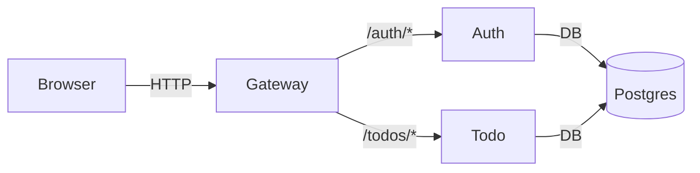

# ADR-0002:  Split Services into Auth and Todo (with API Gateway)

- **Status**: Draft
- **Date**: 2025-11-02
- **Deciders**: Project Owner, Core Devs
- **Supersedes**: —
- **Superseded by**: —

## Context
学習目的ではあるが、将来的な拡張・チーム分割・独立デプロイを見据え、モノリスではなくマイクロサービスで進めたい。最小のビジネス機能は「認証」と「ToDo管理」。認証は他サービスからも再利用可能で、責務分離のメリットが大きい。

## Decision
- サービスを **Auth** / **Todo** に分割。外部からは **API Gateway** 経由でアクセス。
- Auth: 登録/ログイン、JWT発行（stateless）
- Todo: ユーザのJWTを検証し、ユーザ毎にCRUDを提供
- Gateway: `/auth/*` をAuthへ、`/todos/*` をTodoへプロキシ。認証ヘッダの中継/検証を担う

## Consequences

**Positive**

- 責務分離によりスケール/チーム独立性が高い

- 影響範囲が限定されTDDで品質担保しやすい

- Gatewayで観測性・共通機能（Rate limit, Logging, Tracing）集約可

**Negative / Trade-offs**

- 初期構築と運用の複雑性が増す

- ローカル開発はCompose等のオーケストレーション前提

**Alternatives Considered**

- 単一FastAPIモノリス：初期は速いが拡張で密結合化しやすい

- Django monolith + apps：管理は楽だがサービス境界の学習に不向き

## Implementation notes (optional)

- 各サービスは FastAPI + SQLAlchemy + Postgres（テストはSQLite）

- JWTはHS256で開始、将来はJWKS/RSAへ拡張可

## Links

- ADR: TDD for Microservices

- ADR: Dev env with Docker Compose override